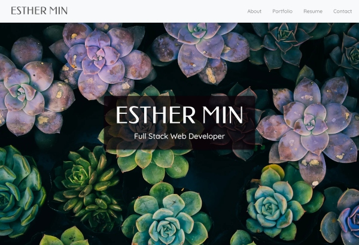

# Portfolio

## Hello! Welcome to my portfolio.

I am a full-stack web developer currently enrolled full-time in the UPenn LPS Coding Bootcamp (August 20, 2020 completion). 

Visit my portfolio to see my work! 
https://jungjungie.github.io/Portfolio/

***Built with React, Reactstrap, and mobile-responsive.***

***
## Other projects not included in portfolio

The following projects are backend-focused and are not listed in my portfolio as there are no deployed links. 

**Employee Management System** (July 2020) 
https://github.com/jungjungie/Employee-Management-System
- A command line app that operates as a CMS (Content Management System) and uses node, inquirer, and MySQL for storing, viewing and deleting employee information.
- Node.js, Inquirer.js, MySQL, Figlet

**Team Summary** (July 2020) 
https://github.com/jungjungie/Team-Summary
- A command line app that utilizes the Inquirer package to take in employee information and generates an HTML webpage that displays summaries of each employee.
- Node.js, Inquirer.js, Jest, HTML 

**ReadMe Generator** (June 2020) 
https://github.com/jungjungie/README-Generator 
- A command line app that dynamically generates a README.md from a user's input.
- Node.js, Inquirer.js

***
## Portfolio Snapshot

  

***
## Contact

Please refer to my portfolio for my contact information. 

**GitHub:**  https://github.com/jungjungie